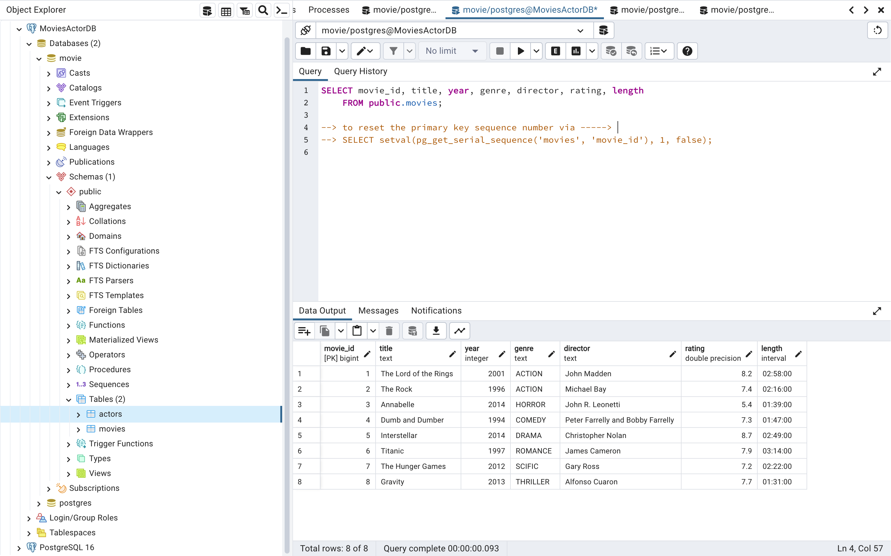
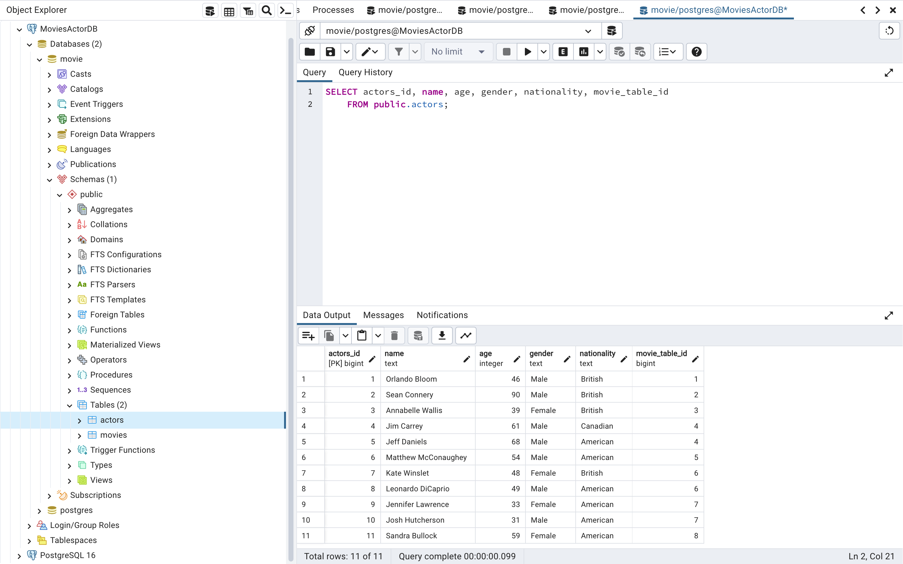

### Images from movies table for the query

### Images from actors table for the query

During the addition of the entries in the DB, I used the SELECT, DELETE as well..
This is how it looks like at the end.. :)))

